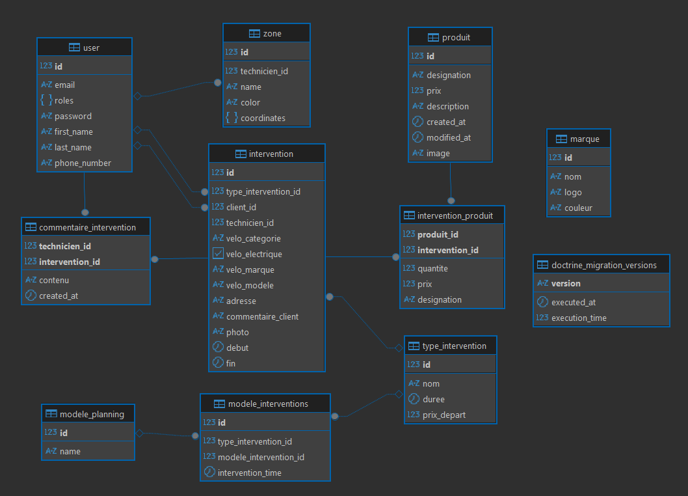

# 🚲 HomeCyclHome – API Symfony

Bienvenue dans le backend de **HomeCyclHome**, un service de réparation et maintenance de vélos à domicile.  
Ce dépôt contient l'API principale, développée avec **Symfony 6.4**, qui alimente trois interfaces :

- Une application admin (gestion des zones, techniciens, demandes…)
- Une application technicien (interventions à venir, détail des demandes…)
- Une application utilisateur (demande d’intervention, inscription, présentation du service)

---

## 📦 Stack technique

- **PHP >= 8.1**
- **Symfony 6.4**
- **Doctrine ORM & Migrations**
- **JWT Authentication** (LexikJWT)
- **PostgreSQL**
- **FrankenPHP** + **Caddy**
- **Docker** / **Docker Compose**
- **Nelmio CORS**, **Monolog**, **Serializer**, **Validator**

---

## 📁 Structure du projet

```
.
├── config/               # Configuration Symfony (routes, services, etc.)
├── docker/               # Configs Docker (facultatif)
├── migrations/           # Fichiers de migration Doctrine
├── public/               # Point d’entrée web
├── src/                  # Code source principal
├── tests/                # Tests unitaires et fonctionnels
├── .env*                 # Fichiers d’environnement
├── Dockerfile / compose.yaml
├── Caddyfile             # Configuration du reverse proxy Caddy
└── README.md
```

---

## 🔐 Authentification

Le projet utilise **JWT** pour sécuriser les routes.

- Endpoint de login (POST) : `/api/login_check`
- Passer ceci dans le body de la requête pour récupérer le token :
  ```
  {
    "username": "mon_identifiant",
    "password": "mon_mot_de_passe"
   }
  ```
- S'authentifier avec le token Bearer pour toutes les autres requêtes :

  ```
  Authorization: Bearer <votre_token>
  ```

- Le bundle [LexikJWTAuthenticationBundle](https://github.com/lexik/LexikJWTAuthenticationBundle) est utilisé pour la gestion du token.

---

## 🔄 Principales fonctionnalités de l’API

- 🔧 Création et gestion des **demandes d'intervention**
- 🛠 Attribution automatique ou manuelle des **techniciens**
- 📍 Gestion des **zones d’action** couvertes
- 👤 Système complet de **gestion des utilisateurs** (admin, techniciens, clients)
- 🔐 Authentification sécurisée via JWT
- 📅 Suivi des interventions et état de la demande

---

## 🧱 Schéma de la base de données



---

## 🛡 Gestion des rôles et des droits

| Rôle         | Description                    | Accès                                  |
|--------------|--------------------------------|-----------------------------------------|
| `ROLE_USER`  | Utilisateur classique (client) | Créer une demande, voir ses demandes    |
| `ROLE_TECH`  | Technicien                     | Voir les interventions assignées        |
| `ROLE_ADMIN` | Administrateur                 | Gérer utilisateurs, zones, techniciens  |

---

## 🔄 Déploiement

1. **Pré-requis :** Docker + Docker Compose installés
2. **Lancer le projet :**

   ```bash
   docker compose up --build
   ```

3. **Accéder au container PHP :**

   ```bash
   docker compose exec php bash
   ```

4. **Lancer les migrations :**

   ```bash
   php bin/console doctrine:migrations:migrate
   ```

5. **Générer les clés JWT :**

   ```bash
   php bin/console lexik:jwt:generate-keypair
   ```

6. **Générer un utilisateur admin :**

   ```bash
   php bin/console create-admin
   ```

